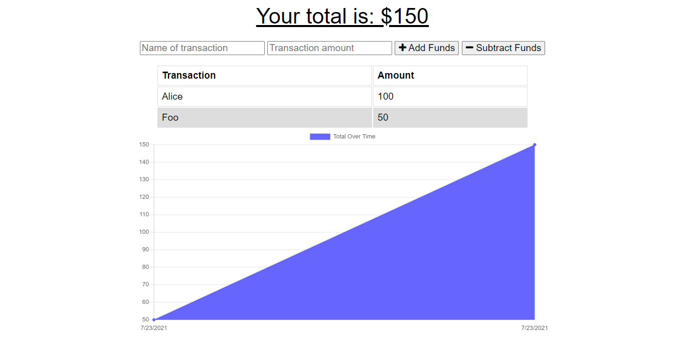
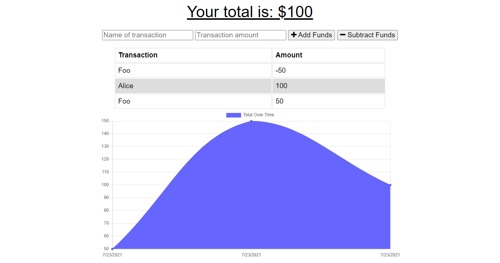

# Budget Tracker

Budget Tracker is a progressive web application that allows users to track their budgets by adding expenses and deposits to their budget through the "Add/Subtract Funds" buttons.

## Heroku Link

This app is deployed through Heroku

[Heroku](https://eti-budget-tracker.herokuapp.com/)

## Project Description

- As a user reaches this website, they could see their budget through the "Add/Subtract Funds" buttons.
- They are able to add a transaction with or without a connection.
- When a user enters a transaction while offline, these transactions are stored in the indexedDB, and transferred to the database when the user comes back online.
- This application is easy to use.

- This website helps you to add funds to your budget easily.
  

- Also, it helps you to subtract the funds from your budget easily.
  

## Usage

- To install the required dependencies, run "npm install".
- To start the server, run "npm run start".
- To access the app after starting the server, go to http://localhost:3000 in your browser.

## Github link

https://github.com/Etipriya/budget-tracker
